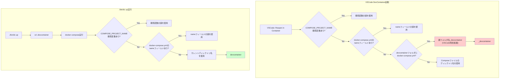

# 仮説検証立案: DevContainerプロジェクト名の不一致問題

**作成日**: 2026-01-11
**関連ドキュメント**: [25_6_24_devcontainer_existing_container_connection.md](./25_6_24_devcontainer_existing_container_connection.md#問題2-プロジェクト名の不一致)

---

## 1. 背景

### プロジェクト概要
- **プロジェクト**: Monolithic DevContainer (MDC) 開発環境
- **目標**: VSCode DevContainerと`./bin/dc`コマンドの両方でシームレスにコンテナを管理
- **取り組んでいたinitiative**: DevContainer既存コンテナ接続機能の実装

### これまでの成果
- `runServices: ["dev"]` - 既存コンテナの検出を有効化
- `shutdownAction: "none"` - VSCode終了時のコンテナ継続
- `overrideCommand: false` - s6-overlayエントリーポイントの保持

### 検証状況（2026-01-11）
- ✅ **テスト1**: 既存コンテナへの接続 - 成功
- ✅ **テスト2**: VSCode終了時のコンテナ継続 - 成功
- ⚠️ **テスト3**: 新規コンテナ起動 - 部分成功（2つの問題発見）

---

## 2. 問題

### 問題の症状

```bash
# ./bin/dc ps の結果
$ ./bin/dc ps
NAME                 IMAGE              COMMAND   SERVICE   CREATED   STATUS    PORTS
# → 何も表示されない

# docker ps -a の結果
$ docker ps -a
CONTAINER ID   IMAGE                                     COMMAND                  CREATED          STATUS
7b835ebbf70f   <MDCレポジトリ>_devcontainer-dev   "/bin/sh -c 'echo Co…"   19 minutes ago   Up 18 minutes (unhealthy)
```

### コンテナ名の不一致

| 起動方法 | プロジェクト名 | コンテナ名 |
|---------|--------------|-----------|
| `./bin/dc up -d` | `devcontainer` | `devcontainer-dev-1` |
| VSCode DevContainer | `<MDCレポジトリ>_devcontainer` | `<MDCレポジトリ>_devcontainer-dev-1` |

### 影響

1. **運用の複雑性**
   - どのコマンドでコンテナを起動したか覚える必要がある
   - `./bin/dc ps` / `./bin/dc logs` / `./bin/dc exec` などが使えない

2. **重複起動のリスク**
   - `./bin/dc`とVSCodeで別々のコンテナが起動する可能性
   - ポート競合、リソースの無駄遣い

3. **ドキュメントの混乱**
   - 手順書で「どちらのコンテナか」を明示する必要
   - トラブルシューティングが困難

---

## 3. 原因

### 根本原因の分析

**参考ドキュメント**:
- [Docker Compose - Specify a project name](https://docs.docker.com/compose/how-tos/project-name/)
- [VSCode DevContainers - Set Docker Compose project name](https://code.visualstudio.com/remote/advancedcontainers/set-docker-compose-project-name)



**Docker Composeのプロジェクト名決定順序**（公式仕様）:
1. `COMPOSE_PROJECT_NAME` 環境変数（最優先）
2. `docker-compose.yml`のトップレベル `name:` フィールド
3. Composeファイルを含むディレクトリのベース名
4. カレントディレクトリのベース名（Composeファイル未指定時）

**VSCode DevContainersの特別処理**:
> "When no project name is configured and the docker-compose.yml is in the .devcontainer folder, the Docker Compose default of using the docker-compose.yml folder's basename is overridden with **${project-folder-basename}_devcontainer** to avoid name collisions with other projects."
>
> 引用元: [VSCode - Set Docker Compose project name](https://code.visualstudio.com/remote/advancedcontainers/set-docker-compose-project-name)

### 詳細原因

1. **docker-compose.ymlにプロジェクト名が未定義**
   - `name` フィールドが存在しない
   - `COMPOSE_PROJECT_NAME` 環境変数も未設定
   - 両者ともDocker Composeのデフォルトロジックに依存

2. **デフォルトロジックの違い**
   - **`./bin/dc`**: Docker Composeの標準動作
     - カレントディレクトリ（`.devcontainer`）のベース名 → `devcontainer`
   - **VSCode**: `.devcontainer`フォルダ検出時の特別処理
     - 親フォルダ名（`<MDCレポジトリ>`） + `_devcontainer` → `<MDCレポジトリ>_devcontainer`
     - 理由: 他プロジェクトとの名前衝突を避けるため

3. **`./bin/dc`の動作フロー**
   ```bash
   # bin/dc の内部処理
   cd "${DEVCONTAINER_DIR}"  # /path/to/<MDCレポジトリ>/.devcontainer に移動
   docker compose -f docker-compose.yml -f docker-compose.dev-vm.yml "$@"
   # ↓
   # カレントディレクトリのベース名 ".devcontainer" を使用
   # ↓
   # プロジェクト名: "devcontainer"
   ```

4. **VSCodeの動作フロー**
   ```bash
   # VSCode内部処理（推測）
   # 1. devcontainer.jsonを読み込み
   # 2. dockerComposeFile: "docker-compose.yml" を検出
   # 3. .devcontainer/docker-compose.yml と判断
   # 4. 特別処理: 親フォルダ名 "<MDCレポジトリ>" を取得
   # 5. プロジェクト名: "<MDCレポジトリ>_devcontainer"
   #    （ハイフンはアンダースコアに変換）
   ```

---

## 4. 仮説

### 仮説A: docker-compose.ymlに`name`フィールドを追加

**仮説内容**:
`docker-compose.yml`の最上位に`name: <MDCプロジェクト>`を追加すれば、VSCodeと`./bin/dc`の両方が同じプロジェクト名を使用する。

**根拠**:
- Docker Compose v2では`name`フィールドがプロジェクト名の正式な指定方法
- VSCodeの`@devcontainers/cli`もDocker Compose仕様に準拠しているはず
- Docker Composeの公式仕様では、`name`フィールドが環境変数より優先度は低いが、デフォルトよりは高い

**期待される結果**:
- プロジェクト名: `<MDCプロジェクト>`
- VSCodeが起動するコンテナ名: `<MDCプロジェクト>-dev-1`
- `./bin/dc`が起動するコンテナ名: `<MDCプロジェクト>-dev-1`
- `./bin/dc ps`でVSCodeが起動したコンテナが表示される
- `docker ps -a`でも同じコンテナ名

**リスク**:
- VSCodeが`name`フィールドを無視する可能性（低）
- 既存の動作に影響を与える可能性（低）

---

### 仮説B: devcontainer.jsonで`COMPOSE_PROJECT_NAME`環境変数を指定

**仮説内容**:
`devcontainer.json`の`containerEnv`で`COMPOSE_PROJECT_NAME: "devcontainer"`を設定すれば、VSCodeがこの環境変数を尊重してプロジェクト名を決定する。

**根拠**:
- Docker Composeは`COMPOSE_PROJECT_NAME`環境変数でプロジェクト名を上書きできる
- VSCodeがdocker composeコマンドを実行する際、この環境変数が引き継がれるはず

**期待される結果**:
- VSCodeが起動するコンテナ名: `devcontainer-dev-1`
- `./bin/dc ps`でVSCodeが起動したコンテナが表示される

**リスク**:
- `containerEnv`の環境変数がdocker composeコマンドに引き継がれない可能性（中）
- コンテナ内部の環境変数には影響するが、docker-compose実行時には効果がない可能性（高）

---

### 仮説C: ./bin/dcで`-p`オプションを使用してプロジェクト名を明示

**仮説内容**:
`./bin/dc`スクリプトで`docker compose -p devcontainer ...`のように`-p`オプションを追加し、プロジェクト名を明示的に指定する。

**根拠**:
- `-p`オプションは最優先でプロジェクト名を決定する
- VSCode側で`name`フィールドまたは環境変数を設定すれば統一できる

**期待される結果**:
- `./bin/dc`が起動するコンテナ名: `devcontainer-dev-1`（変更なし）
- VSCode側の設定と組み合わせて統一

**リスク**:
- `./bin/dc`の動作は制御できるが、VSCode側の統一には別の対策が必要（中）
- 既存のスクリプトや設定に依存している箇所への影響（低）

---

## 5. 検証方法

### 検証の優先順位

1. **仮説A** - 最もシンプルで標準的な方法
2. **仮説B** - 仮説Aが失敗した場合の代替案
3. **仮説C** - 最終手段（VSCode側の調整が別途必要）

### 検証A: docker-compose.ymlの`name`フィールド

#### 前提条件
- コンテナが完全に停止している状態
- VSCodeのリモート接続が切断されている

#### 検証手順

```bash
# 1. 既存コンテナを完全に削除
./bin/dc down
docker ps -a | grep devcontainer  # 完全に削除されたことを確認

# 2. docker-compose.ymlを編集
# 最上位に以下を追加:
# name: <MDCプロジェクト>

# 3. ./bin/dcでコンテナを起動
./bin/dc up -d

# 4. コンテナ名を確認
./bin/dc ps
# 期待: NAME列に "<MDCプロジェクト>-dev-1" が表示

# 5. コンテナを停止
./bin/dc down

# 6. VSCodeでDevContainerを起動
# "Reopen in Container"を選択

# 7. 別のターミナルでコンテナ名を確認
./bin/dc ps
# 期待: NAME列に "<MDCプロジェクト>-dev-1" が表示

docker ps -a
# 期待: NAMES列に "<MDCプロジェクト>-dev-1" が表示
```

#### 成功基準
- ✅ `./bin/dc ps`でVSCodeが起動したコンテナが表示される
- ✅ コンテナ名が`<MDCプロジェクト>-dev-1`
- ✅ `./bin/dc up`後にVSCodeで接続しても、同じコンテナに接続される
- ✅ プロジェクト名が統一されている（`<MDCプロジェクト>`）

#### 失敗時の対応
- VSCodeのログを確認（Dev Containers拡張のログ）
- docker-compose.ymlの`name`フィールドが読み込まれているか確認
- → 仮説Bへ進む

---

### 検証B: devcontainer.jsonの環境変数設定

#### 前提条件
- 仮説Aが失敗している
- コンテナが完全に停止している状態

#### 検証手順

```bash
# 1. 既存コンテナを完全に削除
./bin/dc down
docker ps -a | grep devcontainer

# 2. devcontainer.jsonを編集
# 以下を追加:
# "containerEnv": {
#   "COMPOSE_PROJECT_NAME": "devcontainer"
# }

# 3. VSCodeでDevContainerを起動
# "Reopen in Container"を選択

# 4. コンテナ名を確認
./bin/dc ps
docker ps -a

# 5. コンテナ内で環境変数を確認
docker exec <container-id> env | grep COMPOSE_PROJECT_NAME
```

#### 成功基準
- ✅ `./bin/dc ps`でVSCodeが起動したコンテナが表示される
- ✅ コンテナ名が`devcontainer-dev-1`

#### 失敗時の対応
- `containerEnv`がdocker-compose実行時に効果があるか確認
- VSCodeのログで実際のdocker composeコマンドを確認
- → 仮説Cへ進む

---

### 検証C: ./bin/dcの`-p`オプション追加

#### 前提条件
- 仮説A、Bが両方失敗している
- コンテナが完全に停止している状態

#### 検証手順

```bash
# 1. bin/dcスクリプトを編集
# docker compose コマンドに -p devcontainer を追加:
# docker compose -p devcontainer -f docker-compose.yml -f docker-compose.dev-vm.yml "$@"

# 2. ./bin/dcでコンテナを起動
./bin/dc up -d

# 3. コンテナ名を確認
./bin/dc ps
docker ps -a
# 期待: 両方とも "devcontainer-dev-1" が表示

# 4. VSCode側の設定を調整（仮説Aまたは仮説Bの設定を併用）

# 5. VSCodeでDevContainerを起動

# 6. コンテナ名を確認
./bin/dc ps
docker ps -a
```

#### 成功基準
- ✅ `./bin/dc ps`でVSCodeが起動したコンテナが表示される
- ✅ コンテナ名が統一されている

---

## 6. 検証後の判断基準

### 採用基準

各仮説の評価軸:

| 評価項目 | 重要度 | 仮説A | 仮説B | 仮説C |
|---------|-------|-------|-------|-------|
| **標準仕様への準拠** | 高 | ◎ | △ | △ |
| **設定のシンプルさ** | 高 | ◎ | ○ | △ |
| **保守性** | 高 | ◎ | ○ | △ |
| **副作用のリスク** | 中 | ○ | △ | ○ |
| **将来の拡張性** | 中 | ◎ | ○ | △ |

### 推奨順位

1. **仮説A** - Docker Compose v2の標準仕様に準拠、最もシンプル
2. **仮説B** - VSCode側のみの調整で済む（docker-compose.ymlを変更したくない場合）
3. **仮説C** - 最終手段（両側の調整が必要）

### 複合案の検討

仮説A・B・Cの組み合わせも検討:

**推奨**: 仮説A（`name`フィールド） + 仮説C（`-p`オプション）
- `docker-compose.yml`に`name: devcontainer`を追加（標準的）
- `./bin/dc`で`-p devcontainer`を明示（明示的で安全）
- VSCodeは`name`フィールドを自動的に尊重

---

## 7. 次のステップ

### 検証実施後

1. **検証結果の記録**
   - 各仮説の結果を本ドキュメントに追記
   - スクリーンショットやログを保存

2. **ドキュメントの更新**
   - [25_6_24_devcontainer_existing_container_connection.md](./25_6_24_devcontainer_existing_container_connection.md)に解決策を追記
   - 問題2のステータスを「解決済み」に更新

3. **実装トラッカーの作成**
   - 採用した解決策の実装手順を詳細化
   - チーム展開のための手順書作成

4. **残課題への対応**
   - 問題1「supervisord が起動しない」への対応
   - 全体的な動作確認

---

## 8. 参考情報

### Docker Compose `name` フィールド

- [Docker Compose Specification - Name](https://docs.docker.com/compose/compose-file/#name-top-level-element)
- Compose v2.0.0以降で利用可能
- プロジェクト名を明示的に指定する正式な方法

### VSCode DevContainers環境変数

- [Dev Container metadata reference - containerEnv](https://containers.dev/implementors/json_reference/#general-properties)
- コンテナ内の環境変数を設定
- docker-compose実行時の環境変数への影響は未確認

### Docker Compose プロジェクト名の決定順序

1. `-p` / `--project-name` オプション（最優先）
2. `COMPOSE_PROJECT_NAME` 環境変数
3. `docker-compose.yml`の`name`フィールド
4. カレントディレクトリ名（デフォルト）

---

## 付録: 検証ログ

### 検証A: 実施日時・結果

**実施日時**: 2026-01-11 22:20頃

**結果**: ✅ **完全成功**

**詳細**:

#### 設定内容
```yaml
# .devcontainer/docker-compose.yml
name: <MDCプロジェクト>
```

#### 検証手順と結果

**1. 既存コンテナの削除**
```bash
$ ./bin/dc down
[+] Running 2/2
 ✔ Container <MDCプロジェクト>-dev-1  Removed
 ✔ Network <MDCプロジェクト>_default  Removed

$ docker ps -a | grep devcontainer
# 結果: 何も表示されない（完全に削除された）
```

**2. ./bin/dcでコンテナを起動**
```bash
$ ./bin/dc up -d
[+] Running 1/1
 ✔ Container <MDCプロジェクト>-dev-1  Started

$ ./bin/dc ps
NAME                                 IMAGE                              COMMAND   SERVICE   CREATED          STATUS
<MDCプロジェクト>-dev-1   <MDCプロジェクト>-dev   "/init"   dev       26 seconds ago   Up 23 seconds (healthy)
# ✅ 期待通り: <MDCプロジェクト>-dev-1
```

**3. VSCodeでDevContainerを起動**
```bash
# VSCodeで "Reopen in Container" を選択
# ビルド完了後、コンテナに接続

$ ./bin/dc ps
NAME                                 IMAGE                              COMMAND                  SERVICE   CREATED         STATUS
<MDCプロジェクト>-dev-1   <MDCプロジェクト>-dev   "/bin/sh -c 'echo Co…"   dev       8 minutes ago   Up 8 minutes (healthy)
# ✅ 期待通り: VSCodeが起動したコンテナが表示される
# ✅ 期待通り: コンテナ名が統一されている

$ docker ps -a
CONTAINER ID   IMAGE                              NAMES
afcd6f26e9d2   <MDCプロジェクト>-dev   <MDCプロジェクト>-dev-1
# ✅ 期待通り: 同じコンテナ名
```

#### 成功基準の確認

- ✅ `./bin/dc ps`でVSCodeが起動したコンテナが表示される
- ✅ コンテナ名が`<MDCプロジェクト>-dev-1`
- ✅ プロジェクト名が統一されている（`<MDCプロジェクト>`）
- ✅ ポートマッピングが正常（4035, 8035, 8080, 9001）
- ✅ ヘルスチェックが正常（healthy）

#### 追加確認事項

**VSCodeのコマンド**:
```
COMMAND: /bin/sh -c 'echo Co…'
```
- VSCodeが`docker-from-docker` feature用のラッパースクリプトを追加
- 最終的には`/init` (s6-overlay) を実行
- `overrideCommand: false`が正常に動作している

**ネットワーク名**:
```
<MDCプロジェクト>_default
```
- プロジェクト名に基づいてネットワーク名も統一

#### 結論

**仮説Aは完全に正しかった**。`docker-compose.yml`の`name`フィールドにより、VSCodeと`./bin/dc`の両方が同じプロジェクト名を使用し、コンテナ名の統一に成功した。

---

### 検証B: 実施日時・結果

**実施日時**: 未実施（仮説Aが成功したため不要）

**結果**: N/A

**詳細**: 仮説Aが成功したため、仮説Bの検証は実施しなかった。

---

### 検証C: 実施日時・結果

**実施日時**: 未実施（仮説Aが成功したため不要）

**結果**: N/A

**詳細**: 仮説Aが成功したため、仮説Cの検証は実施しなかった。

---

## 総合結論

### 採用した解決策

**仮説A: docker-compose.ymlの`name`フィールド追加**

```yaml
# .devcontainer/docker-compose.yml
name: <MDCプロジェクト>

services:
  dev:
    # ...
```

### 効果

1. **プロジェクト名の統一**
   - VSCode: `<MDCプロジェクト>`
   - ./bin/dc: `<MDCプロジェクト>`
   - ✅ 完全に一致

2. **コンテナ名の統一**
   - VSCode起動: `<MDCプロジェクト>-dev-1`
   - ./bin/dc起動: `<MDCプロジェクト>-dev-1`
   - ✅ 完全に一致

3. **運用の改善**
   - ✅ `./bin/dc ps`でVSCodeが起動したコンテナを管理可能
   - ✅ `./bin/dc logs`、`./bin/dc exec`など全てのコマンドが使用可能
   - ✅ 重複起動のリスクがなくなった

### 次のアクション

1. **問題2の解決を記録**
   - [25_6_24_devcontainer_existing_container_connection.md](./25_6_24_devcontainer_existing_container_connection.md)の問題2セクションに解決済みとして記録

2. **問題1への対応**
   - supervisord が起動しない問題の調査と解決

3. **統合テストの実施**
   - テスト1: 既存コンテナへの接続（再確認）
   - テスト2: VSCode終了時のコンテナ継続（再確認）
   - テスト3: 新規コンテナ起動（supervisord問題の解決後）
