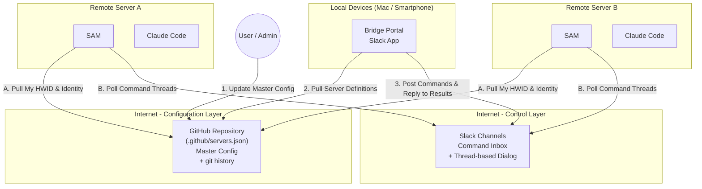
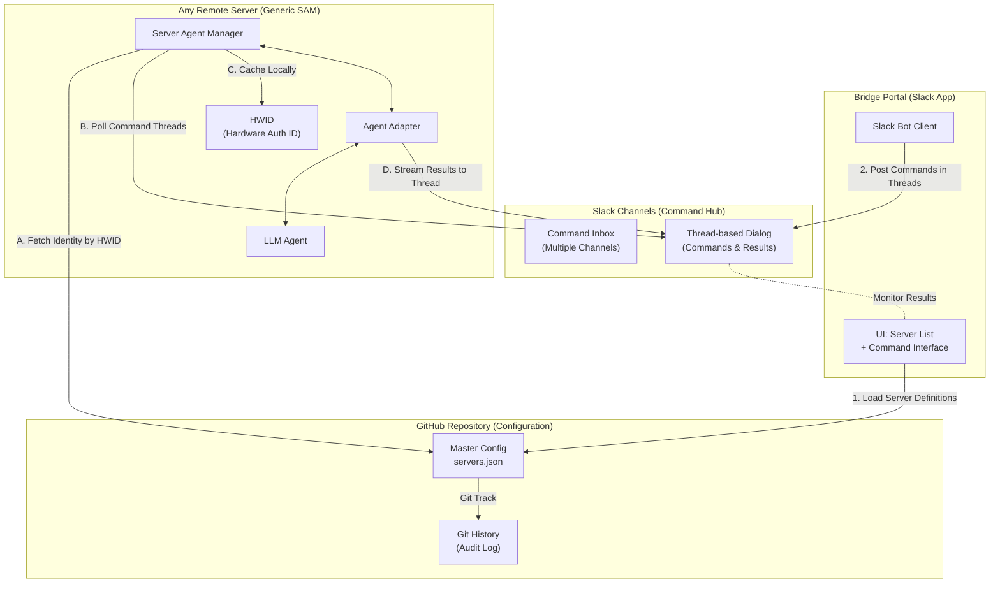
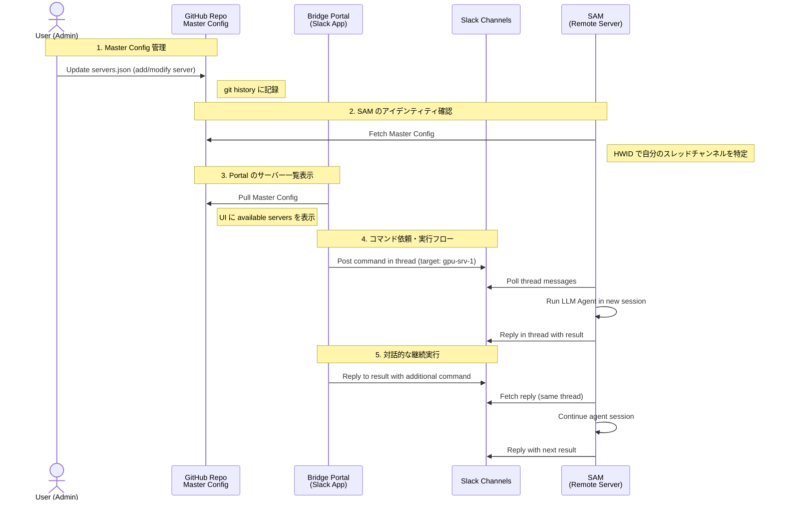

# Architecture Diagrams: Call Remote Server LLM Bridge

## 1. システム全体構成図 (System Overview & Deployment)
GitHub（マスター設定）と Slack（指示・制御）の責務分離による全体構成。

## 2. コンポーネント詳細図 (Component Diagram)
GitHub（Master Config）と Slack（Command Inbox）による責務分離構成。

## 3. シーケンス図 (Sequence Diagram)
GitHub で Master Config を管理し、Slack でコマンド実行・対話するフロー。

