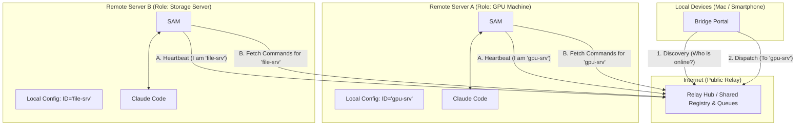
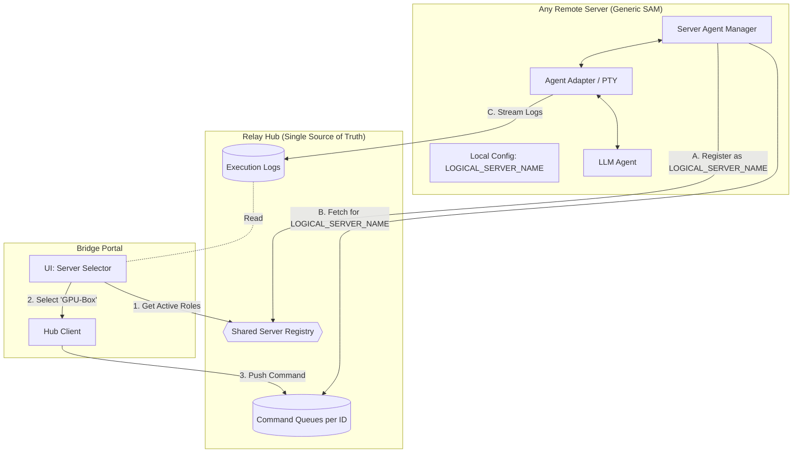
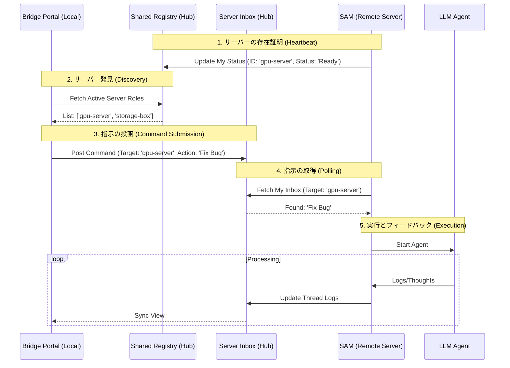

# Architecture Diagrams: Call Remote Server LLM Bridge

## 1. システム全体構成図 (System Overview & Deployment)
ネットワーク隔離を越えて、複数の「個性あるサーバー」を指名操作する全体像。

## 2. コンポーネント詳細図 (Component Diagram)
ソフトウェア内部の責務と、論理サーバー名（Logical ID）によるフィルタリングの仕組み。

## 3. シーケンス図 (Sequence Diagram)
...（以下、前回のシーケンス図を維持）

